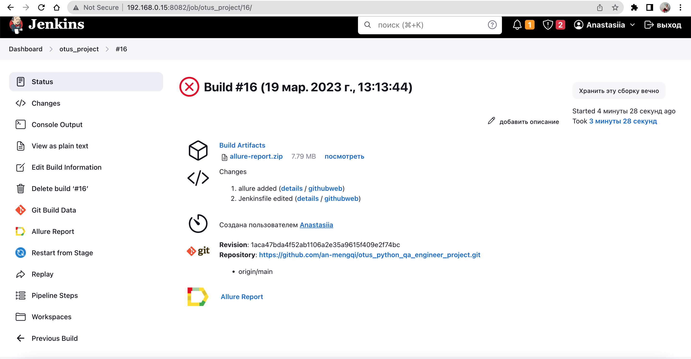
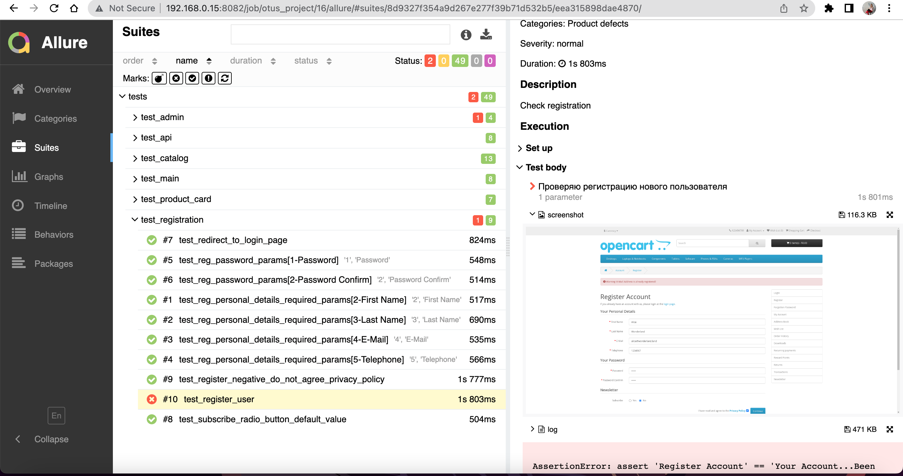

## Проектная работа по курсу "Python QA Engineer" на тему "Автоматизация тестирования приложения opencart и REST API сервиса dog.ceo"
Данный проект содержит в себе UI-автотесты для приложения opencart, а также автотесты для REST API сервиса dog.ceo.\
Применен паттерн PageObject. Используется Selenium.\
UI-автотесты прогоняются в selenoid.\
Тесты и приложение opencart запускаются с помощью docker-compose.\
Запуск происходит на Jenkins, развернутом локально.\
По завершении тестирования в Jenkins генерируется отчет allure.\
Если произошло падение, то прикрепляется скриншот.\

